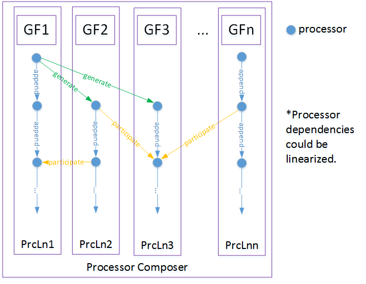

# Mulphys

### 功能定位

Mulphys的基本定位是多物理场技术的工程软件。

- 多物理场问题的发生位置——物理场的交界面。
  - 多物理场的耦合很多情况下都发生在物理场的界面上，因而重点强化了几何表面上场的处理。
- 多物理场问题的数据来源（DataSource）
  - 基于几何直接求解
    - 高超声速压力场
    - 流线积分热流场
    - 基于射线模型的方向场等
  - 基于偏微分方程的导出解且适用于联合求解
    - CFD求解结果（Fastran、CFD++）
    - 有限元求解的表面位移场（PalmCrash）
    - 电磁分析后表面电流分布(CST)

### 应用场景

多物理场有如下典型的使用场景：

- 对于飞行器整体分析，可以融合的流固热燃控红外电磁等多学科耦合仿真
- 外部流场解的融合应用，将现有的多学科物理场的求解结果提取出来后，在界面上进行耦合分析
- 将耦合后的应用用于仿真对象的实时与准实时求解
- 与内部和外部的控制器的支持

### 几何工具支持

- （Rebuilder）原始CAD几何的逆向与网格重构、包面功能（将外部多种输入归一化为单一的可以调节几何表面稠密度的几何，为后面网格稀疏化做准备）
- （Coarsener）网格稀疏化（提升实时解算速度，需要进行网格稀疏化无关性验证）
- （Mapper）同源网格映射（同源网格物理场的映射功能、单一几何分离成多个几何后物理场的继承获取功能）
  - 飞行器在高空分离后，A=>B+C，B和C都是A的子集，B和C都会通过映射获取A的物理场的解
  - 气动热流线积分求解时，流线和表面几何网格是两个不同的几何场，此时二者需要进行网格映射

### 模型界定和场处理器

1. 具有多个同源的几何场，可以有多个相互之间可以实现同源网格映射的几何场（Mapper），可以发生变形，但是不能分裂。区分多个物理场的情况往往是因为问题涉及了多物理场耦合问题，多个物理场可以共享几何也可以分别保存于同源异构的几何上，重要的示例如下：
   * 表面物理场和流线积分场之间是同源的几何场，二者之间存在数据映射
   * 流固耦合物理场而言，流体场和结构场之间可以有两种处理方式，1. 存储在同一个几何上实现共享几何的物理场映射，2. 存储在同源异构几何上通过插值实现几何场映射；
2. 几何场上的最小处理单元是几何片段，场处理器可以处理一个、几个几何片段（例如舵面偏动）和全部的几何片段，所以场处理器运行前配置中主要指定片段索引，未指定则会处理全部几何片段。在处理局部几何片段前，物理场应该已经存在，例如几何法线场处理器会在几何舵面偏动后计算，但几何法线场在最开始就已经存在。
3. 场处理器可以接受多个几何场，同时可以更新多个几何场（append、generate、participate），为了实现求解依序进行，场处理器之间需要进行流水线编排(Processor Composer)，然后将场处理器形成的依赖有向无环图（Dependency DAG）线性化形成可以直接运行的流水线
4. 一个场编排器构成一个模型的内核，形成模型动力学运行的基本函数，此函数会被用作积分器，求解得到模型的演化动力学，Model=ProcessorComposser+Integrator
5. 场处理器和共识变量在下面着重说明其设计思想



### 场处理器和共识变量

1. 在多场耦合求解器中，物理量的耦合发生在场处理器针对不同的变量求解的过程中的，场处理器是通过插件形式解耦开发的，让各个场处理器协作的物理量可以互相复用，必须要通过关键词的方式实现，而物理量的名称则不重要，重要的是物理量所要表达的物理含义才最重要。
2. 那么如何在各个场处理器的开发中实现物理量的统一操作呢？mulphys通过让所有物理量在名称上采用共识变量（consensus）的方式实现——场处理器中互通的物理量都遵循统一的命名标准。
3. 所有的场处理器的共识变量都需要在场处理器的配置文件中设定
   - 场处理器所依赖的变量（dependents描述为[processor名]:[import名]）
   - 将要操作的变量（states、inputs、outputs）都可以直接写成([consensus名])
   - 共识变量包括有如下几类：常用几何量（e.g. vertices、vocc、faces、neighbors等）、常用物理量（e.g. pressure, temperature, alpha, beta, vinf, vmag等）、基本输入输出习惯变量（以x、y、z开头的变量，e.g. x, y, z, x0, xi, xn, y0, yi, yn, z0, zi, zn, ...）
4. 共识变量大大降低了场编排器的配置过程，因为使用了共识变量，所以可以在场编排器的配置文件中制定这些参数的初始值，而不必复杂的指定所有相关场求解器的初始值等参数

共识变量的生成计划有多种途径，但在最初mulphys版本中最开始的共识变量是手动生成的。新增一个processor的时候，就需要在consensus.json文件中增加一个共识变量。共识变量表示意如下：

```json
{
    "geometry-consensuses" : [
        {
            "name" : "vertices",
            "type" : "mat",
            "location" : "vertex-mapped",
            "description" : "几何坐标点坐标矩阵"
        },
        {
            "name" : "faces",
            "type" : "imat",
            "location" : "face-mapped",
            "description" : "几何坐标点坐标矩阵"
        },
        {
            "name" : "vocc",
            "type" : "uvec",
            "location" : "vertex-mapped",
            "description" : "几何坐标点出现过在哪些单元中"
        },
        {
            "name" : "neighbors",
            "type" : "ivec",
            "location" : "face-mapped",
            "description" : "周边邻接单元索引"
        },
    ],
    "processor-consensuses" : [
        {
            "name" : "var0",
            "type" : "vec",
            "location" : "vertex-mapped",
            "description" : "var0 dummy description",
            "producers" : ["foo1", "foo2"] // 这里表示processor foo1 foo2 生成了var0这个共识变量
        },
        {
          "name": "X",
          "children": [
            "vmag",
            "alpha",
            "beta",
            "p",
            "q",
            "r",
            "phi",
            "theta",
            "psi",
            "xg",
            "yg",
            "H"
          ],
          "type": "vec",
          "location": "reduced",
          "description": "飞行器状态向量",
          "producers": [] // 留空表示没有其他场处理器生成此变量
        },
        {
            "name" : "alpha",
            "type" : "reduced",
            "description" : "飞行器攻角(rad)",
            "producers" : []
        },
        ...
    ]
}
```

上述列表是在场处理器运行时生成的，场处理器配置文件举例如下：

```json
{
    "configurations" : {
        "config" : {},
        "config_schema" : {}
    },
    "dependents" : [
        "proc1", "proc2", ...
    ],
    "states" : ["X"],
    "inputs" : ["gamma1", "gamma2"]
}
```

注意outputs在场处理器的配置文件中不用配置。如果需要则配置states和inputs。

先从单流水线举例说明生成步骤如下：

1. 初始场处理器proc0
2. proc0根据dependents描述的依赖共识变量和场处理器获得处理器链procChain
3. 根据扩展场处理器procEx，合并到procChain，形成更新的场处理器链
4. 寻找procChain依赖链条的起始端（单流水线只有一个起始端）
5. 初始化几何场
6. 从起始端开始，将几何场赋值给procChain中所有的场处理器
7. 顺次执行场处理器，根据场编排器指定的状态x和dxdt形成微分方程
8. 根据设定求解（或者不求解就仅仅是计算）常微分方程

多流水线举例说明生成步骤如下：

1. 初始场处理器proc0，proc1，proc2，.... (proci)
2. proci根据dependents描述的依赖共识变量和场处理器获得处理器链procChaini
3. 根据扩展场处理器procEx，合并到procChaini，形成更新的场处理器链
4. 编排多条流水线之间的依赖关系
5. 再次更新形成处理器链（这里会影响算法，本质上处理器链演化为了多个起始端的有向无环图）
6. 寻找所有procChaini依赖链条的起始端（多流水线有多个起始端，注意起始端数量可能小于流水线数量，因为有的流水线会生成几何）
7. 初始化与起始端数量相同的几何场，使用这些对应的几何场提交给这些起始端
8. 从起始端开始，将几何场赋值给procChain中所有的场处理器
9. 顺次执行场处理器，根据场编排器指定的状态x和dxdt形成微分方程
10. 根据设定求解（或者不求解就仅仅是计算）常微分方程


### 模型功能特性

1. 几何场GeometricalField（下称gf）和处理流水线（processor、dynamics、model）是独立存在的，模型的流水线可以配置好后，注入gf
2. gf包含了仿真过程中的所有信息，gf可以随时启停，持久化后还可以继续进行仿真试验
3. 模型的服务模式：脚本模式（Script-Driven）、交互模式（Interaction-Driver）
4. 多模型独立运行且模型之间使用（同源网格映射器Mapper实施）物理场映射
   1. 多分辨率的模型，需要定义状态映射Mapper、分阶段仿真过程中状态交换


### 数据源与场处理器特性

1. （DataSource）数据源适配多种数据库，根据数据库读写效率提供不同支持
2. （DataPoint）数据点适配多种物理解用于高维空间点插值
3. （DataCoordinate）数据坐标与数据点进行映射
4. （DataInterpolator）数据插值器


### 代码模型

#### 运行几何读取

| 主体   | 输入1            | 输入2                    | 输出                      | 动作 |
| ------ | ---------------- | ------------------------ | ------------------------- | ---- |
| reader | reader名称字符串 | 各种类型几何文件所在路径 | mulphys的Json格式几何文件 | read |
|        | cgns             | /path/to/xxxx.cgns       | xxx.geom.mphs             |      |

* 实例：

  ```
  reader r = new reader("cgns")
  geometry g = r.read("/path/to/xxxx.cgns")
  ```


#### 运行几何转换写出（writer）


#### 运行求解器（solver）


processes

* file -> reader -> geometry
* geometry -> writer -> file
* geometry [, field, environment]   -> solver -> field
* field (init) -> dynamics -> field

runner

* model(dynamics1[,dynmiacs2...]) + reporter
* batch + model(dynamics1[,dynmiacs2...]) + reporter
* controller + model(dynamics1[,dynmiacs2...]) + reporter

simulation

* runner1 -> runner2 -> ... ->runnerN
* scheduler


！！！！！！！！

场的处理直接使用armadillo实现，所有元素直接作为mat出现，mat可以转换为scalar和vector

！！！！！！！！


1. 以上每一个对象都需要dump出来，查看其中的详细信息, mulphys dump <object-name>
2. solver不关心变量名称，只关心（1）场变量类型和输入顺序、（2）转换方式是格心格点插值积分、（3）输入输出几何
3. 不考虑边值问题，只考虑初值问题


！！！！！！！！

务必注意分区求解物理场，solver需要接受物理场进行进一步处理

！！！！！！！！


路线图和基本需求

1. 构建内核库，重建resource继承树和geometry类型
2. 实现reader，通过reader读取file生成geometry类型，此类型是可以共享的
3. 代码驱动的配置，全新的mphs语言
4. 支持插件扩展各种组件
5. 支持命令驱动的打包并形成可直接驱动的模型包，代码只提取需要的模型和插件模块进行运行
6. 支持多种几何文件的读取并形成统一的基于Json的数据文件，作为统一的数据交换格式，几何格式要开放，可以被其他工具方便使用
7. Json Schema解析处理使用rapidJson，Json本身的处理使用Qt框架
8. 各种组件存在依存关系，模块之间可以作为其他模块的初始化组成部分


命令行

- mphs read foo.txt (根据后缀名决定读取器，如果有多个对应则提示用户显式制定读取器) 输出bar.pnxf文件
- mphs write bar.pnxf foo.plt
- mphs run foo.pnx (执行panax文件)
- mphs describe component_foo (输出component_foo组件的详细信息)
- mphs version
- mphs help
- mphs package (打包panax为一个独立的可执行包)


